<h1>Estudo de CRUD com Spring Boot</h1>

<h2>Descrição do projeto</h2>

Projeto feito com base na <a href="https://www.youtube.com/watch?v=JrTGB0PEF80&list=PLj8jbyWxdQ-n_2iNXbBQB-79dCMn5ivl0">playlist do canal 4CatsDev</a>. Um site básico de biblioteca onde pessoas podem ser cadastradas de forma permanente utilizando banco de dados. 

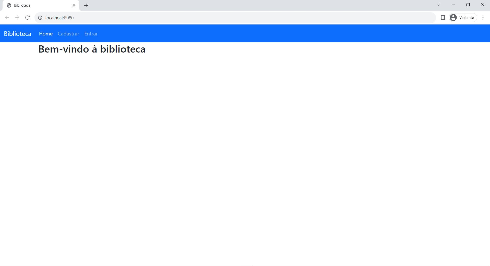

E para cada usuário cadastrado no site, há um papel diferente a ser desempenhado: o de ADMINISTRADOR, o de BIBLIOTECÁRIO e o de USUÁRIO, sendo esse último o padrão para cada conta nova, podendo ser mudado apenas pelo admin. A ERD então se baseia na relação entre o usuário e o seu papel desempenhado no sistema, sendo vários usuários podendo ter vários papéis:

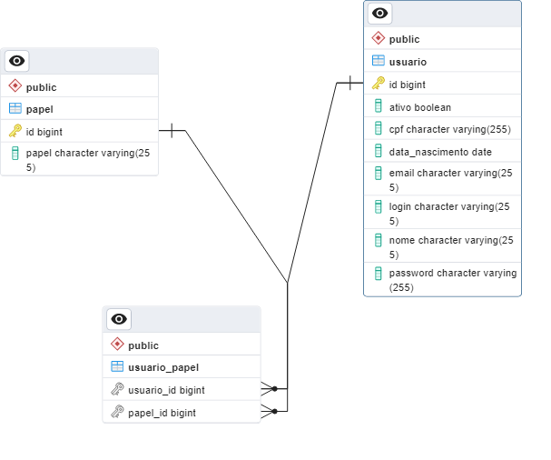

Os papéis exercem uma função fundamental no sistema, que é definir quais páginas podem ser acessadas pelo usuário. Por exemplo: O Admin pode fazer modificações em outras contas, o Usuario não. Para isso, cada um tem seu índex específico.

Antes de mostrar isso, vamos ver como está funcionando o cadastramento de usuários? Como dito anteriormente, cada usuário a ser cadastrado receberá como padrão o papel usuário. Há também o detalhe de, na hora de cadastrar, sempre será apontado em qual campo se encontra um erro no caso de inserção indevida. Por exemplo: CPFs seguem um padrão na hora de serem inseridos, caso você queira passar um texto no CPF, será retornado um erro:

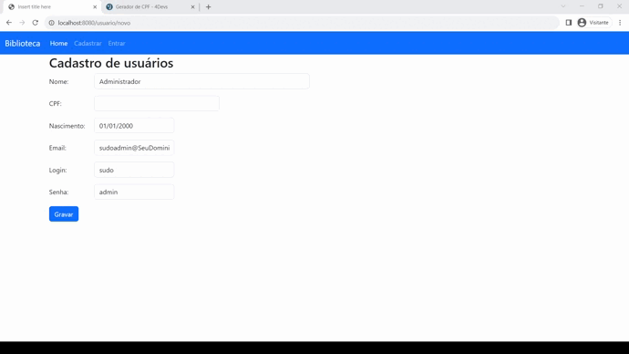

Dei ênfase em dizer que a pessoa cadastrada entra com a permissão de usuário porque é o que acontece agora. ao logar na conta, só será permitido fazer coisas de usuários comuns. Como essa é a primeira conta cadastrada, iremos mudar seu papel manualmente no banco de dados, mas, uma vez que há um Administrador no sistema, ele é responsável por estabelecer os papeis. Outra coisa a ser feita também e que na primeira vez também e de forma manual é ativar o usuário. Podemos fazer isso com essa linha de códigos SQL:

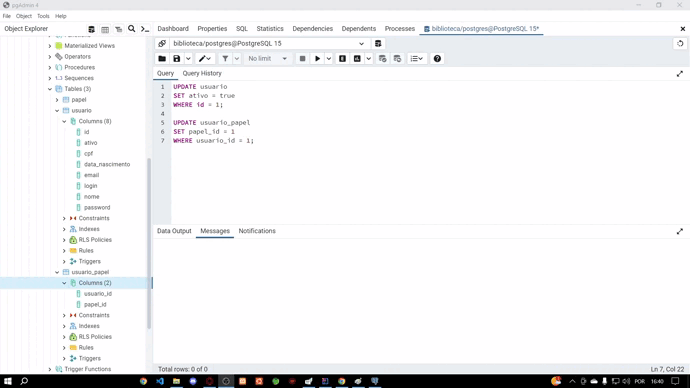

Onde pode ser comprovado através desse Script:

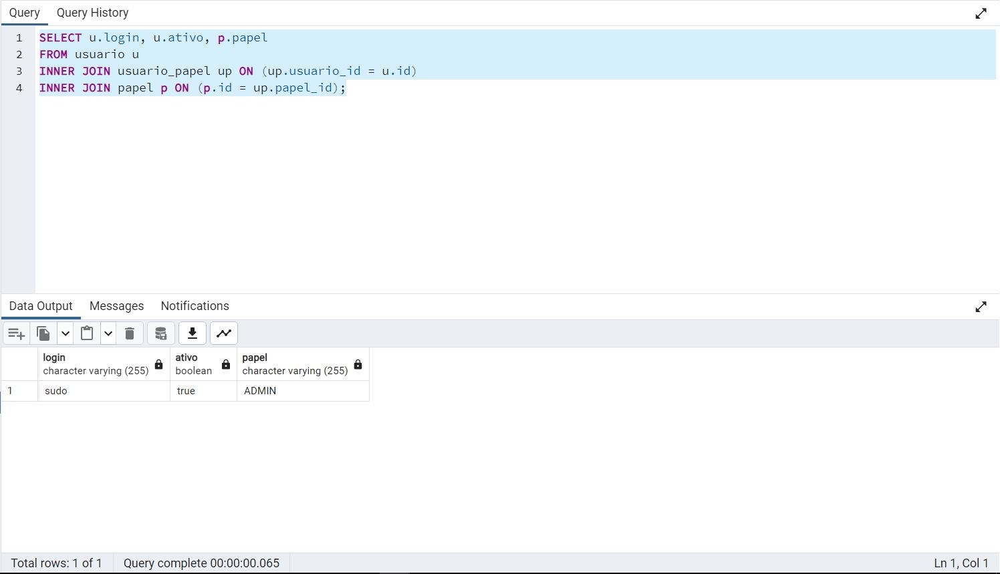

Vamos então ao Login?

Utilizando o Login sudo e a senha admin cadastrada, podemos fazer login como administrador ativo no site. Um ponto a ser citado antes de entramos no login é que a senha chega criptografada ao servidor, trazendo segurança ao usuário.

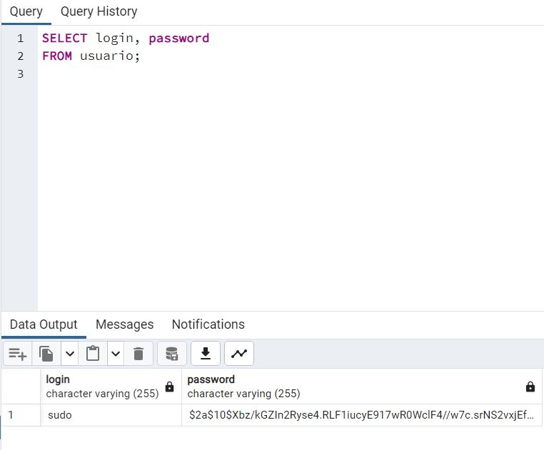

Olhe bem como está a senha no banco de dados. Mas, ao fazer login:

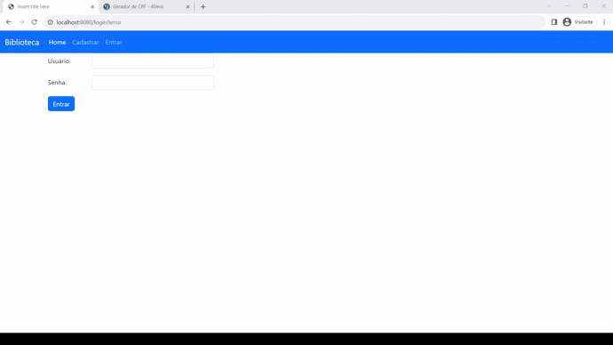

Nesse sistema, a função do Admin é manipular o cadastro dos usuários. Ele tem a função de listar todos cadastrados no banco de dados e editar seus dados, assim como ativar e definir seu papel. Isso é algo exclusivo de administradores no sistema e essa função é encontrada em "Gerenciamento".

Irei criar um novo usuário para mostrar esse poder do administrador.

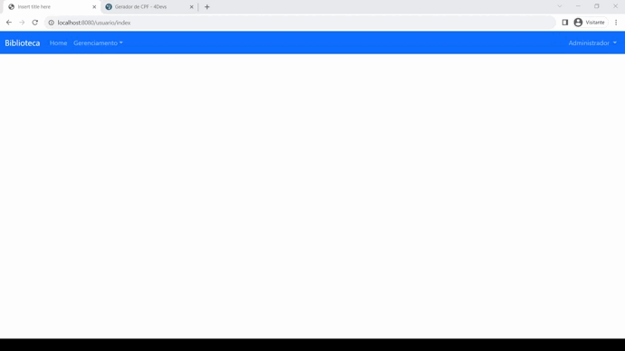

Por fim, criarei mais um usuário agora como User para demostrar como cada tipo de usuário possui uma página diferente. Mas, para criar um novo, iremos fazer um logoff do Administrador e podemos fazer isso clicando em seu nome no canto superior direito e selecionando a opção "Sair"

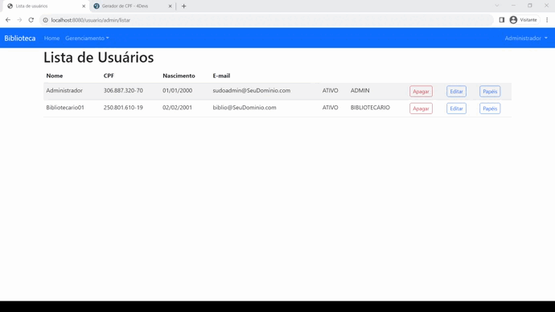

<b>lembre-se: é necessário ativar o usuário através do admin!!!</b>

Assim, podemos ver agora que cada papel tem um index personalizado para exercer a sua função, repare também que para cada usuário, há uma barra personalizada com seu nome que é dado diretamente do banco de dados:

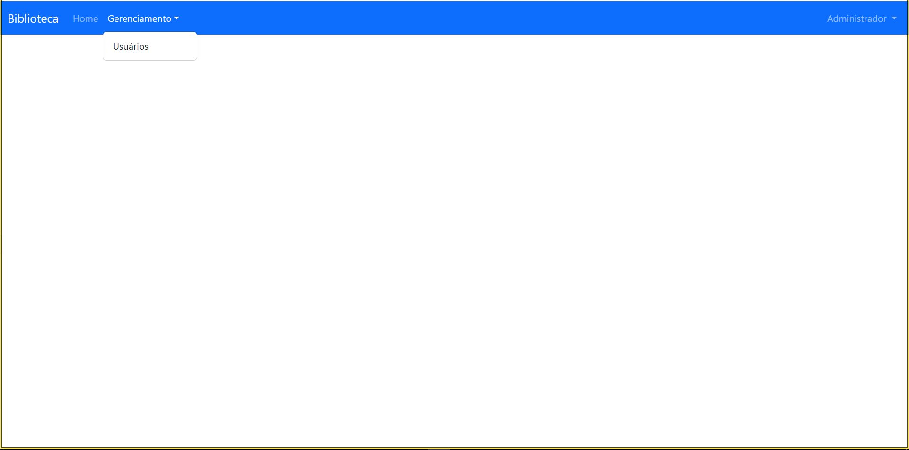

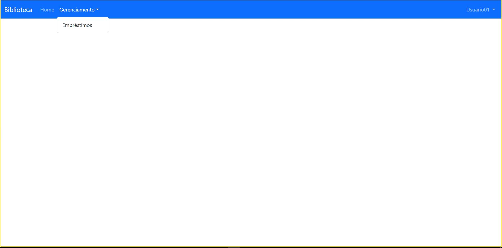

<h2>Tecnologias utilizadas</h2>

Projeto feito utilizando a linguagem de programação Java versão JDK 17 e Bootstrap 5.3.0 para a parte gráfica do projeto. O Framework foi o Spring Boot.

Foi utilizado o PosgreSQL como SGBD responsável por armazenar o login e todos os Scripts feitos no aplicativ PgAdmin4.

Foi utilizado de IDE tanto o Eclipse quanto o InteliJ. Duas IDE com foco em desenvolvimento Java.

<h2>Inicializar</h2>

Para testar o funcionamento em seu computador, é necessário primeiro verificar se sua IDE executa aplicações MAVEN. É muito importante pois o pom.xml é responsável por instalar todas as dependências do projeto na pasta selecionada, para então ser possível o uso.

Outra questão importante é ter um banco de dados Postgres com o nome de "biblioteca". E nele que será armazenado os dados de login.

Por fim, para ter esse repositório em seu computador, pode copiar com o seguinte comando:

    
    git clone https://github.com/patrickmartx/estudoSpringboot.git
    

